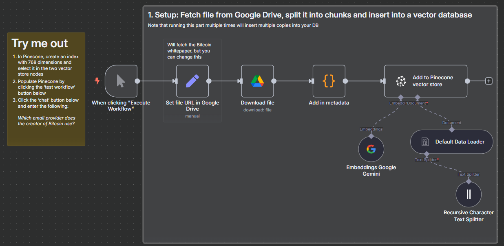
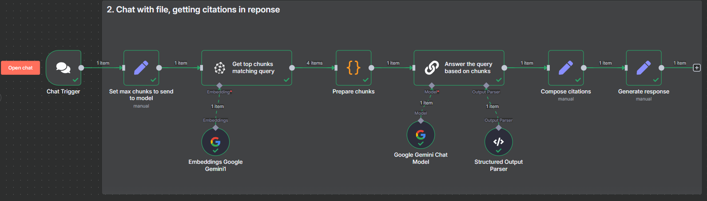
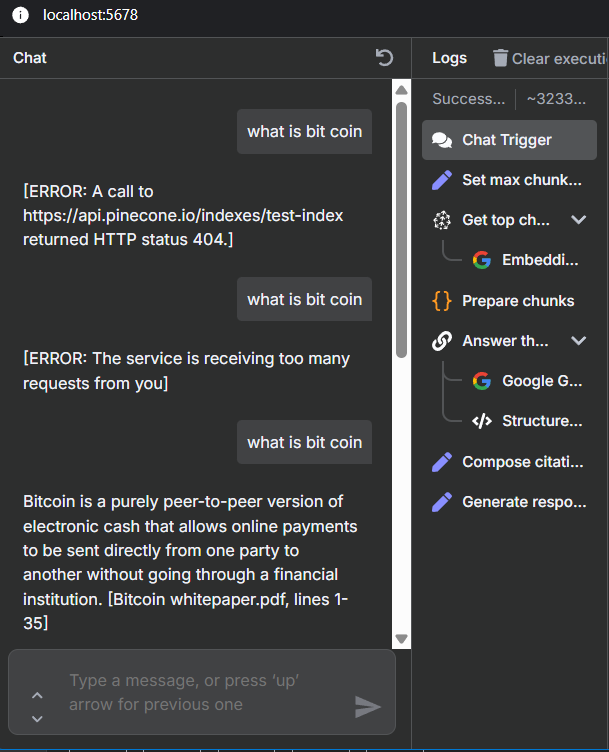

# 📄 Chat with PDF using AI — n8n Workflow

This n8n workflow enables users to upload and query PDF documents using AI. It integrates Google Drive for file access, splits content into semantic chunks, embeds them using Google Gemini, stores them in Pinecone, and enables intelligent Q&A over the document via natural language prompts.

---



## 🚀 Features

- 📁 Fetch PDF file from Google Drive  
- 📄 Split content into overlapping chunks  
- 🧠 Generate text embeddings using Google Gemini  
- 🧬 Store vectors in Pinecone for semantic search  
- 🤖 Ask natural questions via a webhook  
- 📚 Retrieve relevant chunks and generate answers with citations  

---

## 🧩 Workflow Structure

### 📥 1. Document Ingestion
- **Set file URL in Google Drive**: Specify the document to use.
- **Download file**: Fetch the file from Drive.
- **Add in metadata**: Add filename, URL, and file extension.
- **Recursive Character Text Splitter**: Break text into overlapping chunks (size: 3000, overlap: 200).
- **Embeddings Google Gemini**: Convert chunks into 1536-dimensional vectors.
- **Default Data Loader**: Load and process binary content.
- **Add to Pinecone vector store**: Insert embeddings into Pinecone.

### 💬 2. Q&A Over PDF
- **Chat Trigger**: Webhook to receive user’s question.
- **Set max chunks to send to model**: Limit the number of retrieved results.
- **Embeddings Google Gemini**: Embed user question.
- **Get top chunks matching query**: Perform vector similarity search in Pinecone.
- **Prepare chunks**: Aggregate the best-matching chunks.
- **Google Gemini Chat Model**: Use context to answer the question.
- **Structured Output Parser**: Parse answer and citations.
- **Compose citations**: Format matched chunk references.
- **Generate response**: Final response output with optional citations.

---

## 🧠 Tech Stack

| Component                  | Role                                          |
|---------------------------|-----------------------------------------------|
| n8n                       | Workflow automation                           |
| Google Drive              | PDF file storage                              |
| Langchain                 | AI orchestration framework                    |
| Google Gemini (PaLM)      | Embedding + LLM for Q&A                       |
| Pinecone                  | Vector database for semantic retrieval        |

---

## 🛠️ Setup Instructions

1. **Pinecone Setup**
   - Create an index named (e.g., `n8n-2`) with **764 dimensions**
   - Provide API credentials in n8n

2. **Google Drive Access**
   - Authenticate via OAuth2 in n8n to access files

3. **Google Gemini API**
   - Add your Gemini (PaLM) API key in n8n credentials

4. **Run Workflow**
   - Trigger workflow manually to ingest document
   - Use chat webhook to submit a question

---

## 📬 Webhook Example

```http
POST /webhook/1727c687-aed0-49cf-96af-e7796819fbb3
Content-Type: application/json

{
  "chatInput": "What is the purpose of the Bitcoin whitepaper?"
}
```

---

## 🧪 Sample Output

```text
Answer: The purpose of the Bitcoin whitepaper is to propose a peer-to-peer electronic cash system.
Source: [bitcoin.pdf, lines 4–10]
```


---

## ⚠️ Notes

- Avoid re-running ingestion to prevent duplicate records in Pinecone
- Ensure vector size of Gemini embeddings matches Pinecone index dimension (1536)
- Chunking strategy helps preserve context for large PDFs

---

## 👨‍💻 Author

Developed using:
- **n8n** for workflow automation  
- **Google Gemini** for AI Q&A  
- **Pinecone** for vector-based document search  
- **LangChain** for prompt handling and chunk parsing  

Perfect for document assistants, PDF search bots, internal Q&A tools, or research assistants.
